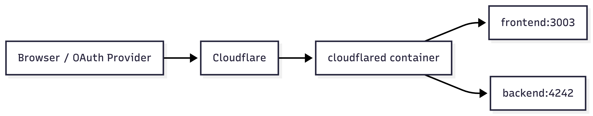

# Dev Containers + AI Agents + Cloudflare Tunnel

Технічна презентація для middle/senior developers.
Контекст: практичний стек, який вже використовується в щоденній роботі, з фокусом на безпеку і DX.

## Головний CTA

- Ознайомтеся з репозиторієм.
- Запустіть локально у себе.
- Спробуйте покращити під ваші реальні задачі.

## Формат (30-40 хв)

- 50%: Dev Containers (архітектура, workflow, ризики, порівняння підходів).
- 30%: Cloudflare Tunnel (архітектура, Public vs Access-protected, OAuth).
- 20%: AI + security controls (threat model, guardrails, anti-patterns).

## Що є в цьому репозиторії

- `backend/` — NestJS submodule, `APP_PORT` (default `4242`).
- `frontend/` — Next.js submodule, `3003`.
- `.devcontainer/devcontainer.json` — VS Code dev environment as code.
- `.devcontainer/docker-compose.yml` — `db`, `backend`, `frontend`, `mailcatcher`, `adminer`, `cloudflared`.
- `AGENTS.md` — правила для AI-агентів у цьому репозиторії.
- `docs/CONTAINERS-DEMO.md` — фінальна структура і контент презентації.

## Слайд 0. Title

`Dev Container + AI + Tunnel`

на прикладі NestJS + NextJS + Postgres + Adminer + Mailcatcher

https://github.com/unibrix/dev-container-boilerplate

## Слайд 1. Problem Statement

- Drift середовищ: різні версії Node, package manager, system libs, shell-tools.
  Нестабільний onboarding і непередбачуваний time-to-first-run.

- Security debt: запуск незнайомих `npm` скриптів і CLI-команд напряму на host OS.
  Наслідок: ризик втрати локальних секретів, credential leak, компрометація персонального середовища.

- Integration friction: без стабільного HTTPS URL важко тестувати OAuth callbacks і webhooks.
  Наслідок: тимчасові костилі, ручні обхідні рішення, повільні інтеграційні ітерації.

- AI execution risk: агент з full-access (yolo) може виконати руйнівну або небезпечну команду.
- Наслідок: небажані зміни у файлах, конфігах, git-стані та потенційний security incident на хості.


## Слайд 2. Why This Stack

- Це практичний стек, який я використовую в роботі і пропоную як шаблон для ознайомлення.
- Швидкий старт як для нового, так і для існуючого проєкту: `Reopen in Container` замість ручного сетапу.
- Краща безпека: незнайомий код/пакети/CLI виконуються в контейнері, а не напряму на host OS.
- Проєктний набір інструментів і плагінів фіксується в репозиторії: runtime + VS Code settings/extensions.
- AI-асистент з широкими правами працює в керованому середовищі, де простіше застосувати guardrails.

## Слайд 3. `devcontainer.json` за 60 секунд

```jsonc
{
  "name": "unibrix-dev (...)", // Людська назва середовища у VS Code
  "dockerComposeFile": ["docker-compose.yml"], // Звідки беруться сервіси
  "service": "backend", // Контейнер, в який під'єднується VS Code
  "workspaceFolder": "/workspaces/app", // Root робочої директорії в контейнері
  "shutdownAction": "stopCompose", // Що робити з compose-стеком при закритті
  "remoteUser": "node", // Non-root user для щоденної роботи

  "mounts": [
    "type=bind,source=${localEnv:HOME}/.codex,target=/home/node/.codex",
    "type=bind,source=${localEnv:HOME}/.gitconfig,target=/home/node/.gitconfig,readonly",
  ], // Межа між host і контейнером

  "forwardPorts": [4242, 3003, 1080, 8080, 9229], // Які порти доступні на хості

  // опціонально, опис портів для VSCode
  "portsAttributes": {
    "4242": { "label": "Backend API", "onAutoForward": "notify" },
  },

  "customizations": {
    "vscode": {
      "extensions": ["..."], // Проєктні extensions
      "settings": { "...": "..." }, // Проєктні VS Code settings
    },
  },

  "postCreateCommand": "node -v && npm -v", // Команда після створення контейнера
}
```

- `.devcontainer/devcontainer.json`: service, mounts, extensions, settings, ports.
- `.devcontainer/docker-compose.yml`: app/data services.
- `.devcontainer/Dockerfile`: базовий image + toolchain (`@openai/codex`).
- `.devcontainer/.env` і `.env.example`: конфіг і секрети.

## Слайд 4. Threat Model

- Вектор: supply chain через `postinstall`/`prepare` у залежностях.
  - Сценарій: пакет виконує shell, читає файли/змінні середовища, робить outbound exfiltration.
  - Impact: витік токенів, сесійних ключів, конфігураційних секретів.

- Вектор: шкідливий код у самому репозиторії (`scripts`, hooks, helper CLI).
  - Сценарій: `npm run dev` або `npm run setup` запускає приховані side-effects.
  - Impact: несанкціоновані зміни, бекдори в локальному середовищі, data leakage.

- Вектор: AI agent з широкими правами в терміналі/FS.
  - Сценарій: виконання небезпечних команд, не контрольовані масові зміни.
  - Impact: втрата даних, небажані зміни в хост системі, потенційний security incident.

## Слайд 5. Dev Container: Scope та Межі

### Це:

- Відтворюване dev-середовище як код (IaC): runtime, tooling, editor setup.
- Швидший onboarding і менше environment drift.
- Кращий контроль ризиків при запуску незнайомого коду.

### Не дає:

- Оркестрацію для production.
- Повну ізоляцію VM-рівня .
- Гарантію безпеки без додаткових командних правил.
- I/O performance не такий як на хості.

### У цьому репозиторії це реалізовано так:

- `.devcontainer/devcontainer.json` фіксує `service`, `remoteUser`, `mounts`, `forwardPorts`, VS Code policy.
- `.devcontainer/docker-compose.yml` фіксує склад сервісів (`backend`, `frontend`, `db`, `mailcatcher`, `adminer`, `cloudflared`).
- Guardrails і anti-patterns винесені в окремі слайди як best practices.

## Слайд 6. Порівняння підходів

| Критерій (developer view)    | Local Host                                | Dev Container + Compose                            |
| ---------------------------- | ----------------------------------------- | -------------------------------------------------- |
| Onboarding speed             | Нестабільний, залежить від стану host     | Швидкий і повторюваний через `Reopen in Container` |
| Tooling consistency          | Часто різні версії Node/npm/CLI           | Зафіксовано в repo, передбачувано для команди      |
| Context switch між проєктами | Часті конфлікти залежностей і портів      | Ізольовані середовища per-project                  |
| Reproducibility багів        | "Works on my machine" трапляється частіше | Вища відтворюваність сценаріїв                     |
| IDE parity                   | Плагіни і settings у кожного свої         | Проєктна VS Code policy в `devcontainer.json`      |
| Debugging setup              | Ручний attach/налаштування у кожного dev  | Стандартизований сценарій debug                    |
| CI parity                    | Низька                                    | Вища (ближче до контейнеризованих CI job)          |
| Reset/Cleanup                | Складніше прибрати локальний "слід"       | Простий reset через rebuild/down                   |
| Security                     | Низька/середня                            | Середня/вища за умови guardrails                   |
| Local performance            | Краща raw-продуктивність                  | Може бути нижча на bind mounts (macOS/Windows)     |
| Cost (setup/maintenance)     | Низький старт, вищий hidden team cost     | Середній старт, нижчий командний OPEX              |

## Слайд 7. Чому не просто `docker compose up`

- Compose піднімає сервіси, але не стандартизує IDE/tooling поведінку.
- Dev Container фіксує VS Code extensions/settings разом із runtime.
- Один вхід у середовище: термінал, плагіни, lint/format версії — консистентні.
- Менше локального "зоопарку" на host OS.
- Типовий підхід: `db/mail/adminer` у `docker-compose`, а `backend/frontend` запускаються на host - не покращує безпеку.

## Слайд 8. VS Code Workflow

- Потрібно: Docker Desktop + VS Code + Dev Containers extension.
- Запуск: `Cmd + Shift + P > Dev Containers: Reopen in Container`.
- Вихід: `Cmd + Shift + P > Dev Containers: Reopen Folder Locally`.
- Перезбірка: `Dev Containers: Rebuild and Reopen in Container`.
- Перший запуск зазвичай довший (pull/build image), наступні — значно швидші.
- Логи сервісів: Docker Desktop (агреговані по всіх контейнерах) або `docker compose logs -f <service>`.
- Візуальна індикація активного devcontainer через Peacock (`peacock.remoteColor`) зменшує помилки context-switch.

## Слайд 9. Live Demo

### devcontainer demo

- Reopen in Container.
- показати, що VS Code settings/extensions підтягнулися автоматично.
- показати `docker compose ps` і `docker compose logs -f backend`.
- перевірити локальні endpoints (`3003`, `4242`, `8080`).

### cloudflare

- відкрити frontend URL у браузері.
- пройти Google login і callback на backend.
- показати backend logs з callback-запитом.
- зупинити контейнер і перевірити URL.

## Слайд 10. Cloudflare Tunnel: навіщо

- HTTPS endpoints без відкриття inbound портів на роутері.
- Стабільні URL для callback/webhook flows.
- Швидкий демонстраційний доступ для команди або клієнта.
- Менше тимчасових staging-деплоїв для інтеграційних перевірок.



## Слайд 11. Cloudflare Tunnel: як налаштувати

- Створити акаунт Cloudflare (email + пароль) + 2FA.
- Cloudflare Dashboard > Onboard a domain / Add a site, ввести свій домен.
- Обрати Free план.
- У реєстратора домену (наприклад nic.ua з free доменом в зоні pp.ua) замінити NS на ті, що дав Cloudflare.
- Відкрити Cloudflare Zero Trust. Далі Networks → Connectors → Cloudflare Tunnels.
- Create a tunnel → тип конектора Cloudflared → задай назву → Save.
- Токен додай в .devcontainer/.env в CLOUDFLARED_TOKEN

## Слайд 12. Guardrails і Checklists

- `remoteUser` non-root за замовчуванням.
- Не монтувати host-sensitive шляхи (browser profiles, wallets, ssh keys без потреби).
- Не монтувати `docker.sock` без обґрунтування.
- Секрети тільки через env/secret store.
- Secret scanning в CI (`gitleaks`/аналог).
- Обов'язковий code review AI-generated змін.
- Логування і аудит критичних команд.

## Слайд 13. Anti-patterns (реально болючі)

- Коміт `.env` з токенами/ключами.
- Коміт runtime-даних БД (`postgres/`) у git.
- Public tunnel для Adminer/internal UI.
- Ручна зміна портів без синхронізації docs.
- Дублювання setup кроків у чатах замість конфігу в репозиторії.
- "Швидко на хості" замість reproducible container workflow.

## Слайд 14. Closing

- Підхід не позиціонується як "єдино правильний".
- Це практичний baseline, який зменшує ризики й прискорює старт.
- Спробуйте репозиторій локально.
- Поверніться з критикою і покращеннями.

## Слайд 15. Q&A: Discussion starter

- Який у вас зараз baseline: host-only, гібрид (compose + локальний app) чи повний Dev Container?
- Чи прийнятний для вас Public Tunnel для демо, і де межа між demo та internal-only?
- Які локальні сервіси ви б не публікували через тунель?
- Чого вам не вистачає тут?
- Які ризики або заперечення ви бачите для того щоб почати це використовувати?
- Які guardrails для AI agent ви вважаєте обов’язковими?

### Посилання

- [https://github.com/unibrix/dev-container-boilerplate](https://github.com/unibrix/dev-container-boilerplate)
- [https://containers.dev](https://containers.dev)
- [https://marketplace.visualstudio.com/items?itemName=ms-vscode-remote.remote-containers](https://marketplace.visualstudio.com/items?itemName=ms-vscode-remote.remote-containers)
- [https://cloudflare.com](https://cloudflare.com)
